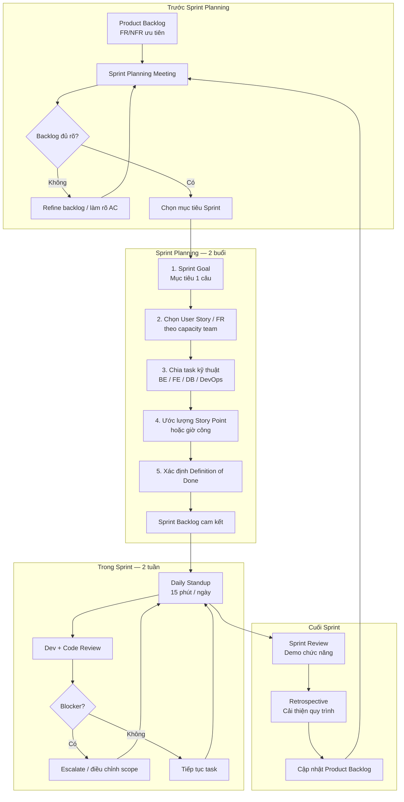
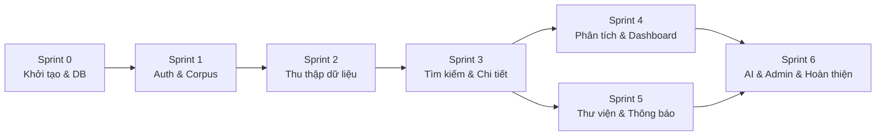
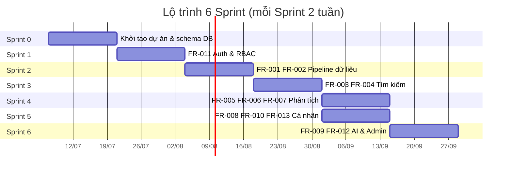

# Kế hoạch Sprint — Scientific Research Trend Tracking System

> Phiên bản: 1 | Ngày cập nhật: 2026/7/3  
> Căn cứ: READ.md, Danh_sach_yeu_cau_chuc_nang.md, Danh_sach_yeu_cau_phi_chuc_nang.md, bsonSchema.md

**Phương pháp:** Scrum  
**Độ dài Sprint:** 2 tuần  
**Tổng số Sprint:** 6 (+ Sprint 0 khởi tạo)  
**Stack:** MongoDB, Redis, Backend API, Frontend Web

---

## 1. Sơ đồ quy trình Sprint Planning

---

## 2. Lộ trình Sprint & phụ thuộc chức năng

> **Lưu ý:** Sprint 4 và Sprint 5 chạy **song song** nếu team ≥ 4 người (2 nhánh: Analytics / User features). Team nhỏ thì chạy tuần tự: Sprint 4 → Sprint 5 → Sprint 6.

---

## 3. Sprint Goal & Backlog chi tiết

### Sprint 0 — Khởi tạo dự án (2 tuần)

**Sprint Goal:** Thiết lập môi trường dev, cấu trúc repo và triển khai schema MongoDB/Redis cơ bản.

| ID | Hạng mục | Task cụ thể | Deliverable |
| --- | --- | --- | --- |
| S0-01 | Setup | Khởi tạo repo, cấu trúc BE/FE, CI cơ bản, `.env` mẫu | Repo chạy được local |
| S0-02 | DB | Tạo 9 collections theo `bsonSchema.md`; seed `data_sources` (6 nguồn) | MongoDB + indexes |
| S0-03 | Cache | Cấu hình Redis; key pattern `view:*`, `top_papers:30d` | Redis kết nối OK |
| S0-04 | Docs | Đồng bộ README, hướng dẫn chạy dự án | `README` dev setup |
| S0-05 | NFR | TLS local/dev; chuẩn bị bcrypt, JWT middleware skeleton | NFR-003, NFR-008 (khung) |

**Chưa làm:** FR chức năng nghiệp vụ (bắt đầu Sprint 1).

---

### Sprint 1 — Xác thực & nền tảng người dùng (2 tuần)

**Sprint Goal:** Người dùng đăng ký, đăng nhập, phân quyền RBAC; Admin/User route tách biệt.

| FR | Chức năng cần làm | Task | Acceptance Criteria |
| --- | --- | --- | --- |
| **FR-011** | Quản lý người dùng | API đăng ký / đăng nhập / logout | Email unique, password bcrypt |
| **FR-011** | RBAC | Middleware phân quyền `Student` \| `Admin` | Admin route bị chặn với Student |
| **FR-011** | Hồ sơ | API xem/sửa `full_name`; load `roles` cùng profile | BR-039: role load tức thì |
| — | FE | Màn hình Login, Register, Profile | Luồng E2E đăng nhập OK |
| — | NFR-003 | JWT hoặc session an toàn; validate input | Không lộ `password_hash` |

**Phụ thuộc:** Sprint 0 (`users` collection).

---

### Sprint 2 — Pipeline thu thập & Research Corpus (2 tuần)

**Sprint Goal:** Batch thu thập metadata từ ít nhất 2 nguồn (OpenAlex + arXiv), chuẩn hóa và dedup vào `papers`.

| FR | Chức năng cần làm | Task | Acceptance Criteria |
| --- | --- | --- | --- |
| **FR-001** | Batch thu thập | Job cron thu thập OpenAlex, arXiv (MVP); mở rộng 4 nguồn còn lại nếu kịp | Metadata vào `papers`, không full-text |
| **FR-001** | Lập lịch | Cấu hình `sync_schedule` trên `data_sources` | BR-004: chạy định kỳ |
| **FR-002** | Chuẩn hóa | Map schema chung: title, abstract, keywords, authors, year, DOI, sources[] | BR-002, BR-020 |
| **FR-002** | Dedup | Hợp nhất theo DOI; fallback `title_normalized` + year | BR-003 |
| **FR-002** | Cleaning | Loại/mark `Rejected` bản thiếu title hoặc abstract | BR-005 |
| **FR-012** | Giám sát (partial) | Ghi `system_logs` ApiError/BatchJob; cập nhật `data_sources.last_sync_status` | BR-007, NFR-004 |
| — | NFR-007 | Batch incremental hoàn thành trong khung 8h (test với subset) | Log thời gian job |

**Phụ thuộc:** Sprint 1 (Admin có thể xem trạng thái sync).

**Stretch goal:** Đủ 6 nguồn READ.md §6.

---

### Sprint 3 — Tìm kiếm & chi tiết bài báo (2 tuần)

**Sprint Goal:** User tìm kiếm, lọc, sắp xếp bài báo; xem chi tiết metadata và ghi Unique Views.

| FR | Chức năng cần làm | Task | Acceptance Criteria |
| --- | --- | --- | --- |
| **FR-003** | Tìm kiếm cơ bản | Full-text title, abstract, keywords; filter tác giả, năm, lĩnh vực, nguồn | BR-009, BR-010 |
| **FR-003** | Tìm kiếm nâng cao | AND/OR/NOT trong `criteria` | BR-011 |
| **FR-003** | Sắp xếp | Theo relevance, năm, `citation_count` | BR-012 |
| **FR-003** | Ẩn Archived | Query mặc định loại `status: Archived` | BR-006 |
| **FR-004** | Chi tiết bài báo | Màn hình metadata, abstract, DOI, link ngoài | BR-013 |
| **FR-004** | Unique Views | Redis dedup 30 phút → ghi `paper_views` | BR-043, NFR-011 |
| — | FE | Trang Search + Paper Detail | NFR-001: hiển thị ≤ 3s (subset data) |

**Phụ thuộc:** Sprint 2 (`papers` có dữ liệu).

---

### Sprint 4 — Phân tích xu hướng & Dashboard (2 tuần)

**Sprint Goal:** Thống kê xu hướng, Research Gap, dashboard trực quan hóa và Top bài thịnh hành.

| FR | Chức năng cần làm | Task | Acceptance Criteria |
| --- | --- | --- | --- |
| **FR-005** | Xu hướng | Aggregation theo năm/tháng, tốc độ tăng trưởng | BR-015, BR-016 |
| **FR-005** | Gợi ý từ khóa | Co-occurrence keywords / related topics | BR-017 |
| **FR-006** | Research Gap | So sánh mật độ công bố giữa `research_fields` | BR-018 |
| **FR-007** | Biểu đồ xu hướng | Line chart theo thời gian | BR-022 |
| **FR-007** | Heatmap Gap | Heatmap / bubble chart Research Gap | BR-023 |
| **FR-007** | Top trending | Aggregate `paper_views` 30 ngày + cache Redis | BR-044, NFR-011 |
| **FR-013** | Báo cáo (partial) | Hiển thị snapshot thống kê trên UI | BR-025 |

**Phụ thuộc:** Sprint 3 (`paper_views`, search filters làm input phân tích).

---

### Sprint 5 — Thư viện cá nhân & theo dõi chủ đề (2 tuần)

**Sprint Goal:** Lưu bài báo, quản lý thư mục, theo dõi chủ đề và nhận thông báo bài mới.

| FR | Chức năng cần làm | Task | Acceptance Criteria |
| --- | --- | --- | --- |
| **FR-008** | Lưu bài báo | Lưu reference từ kết quả tìm kiếm vào `user_collections` | BR-027 |
| **FR-008** | Thư mục CRUD | Tạo/sửa/xóa collection; di chuyển bài giữa thư mục | BR-028 |
| **FR-008** | Toàn vẹn | `title_snapshot`, `availability` khi paper Archived | BR-028, FR-008 |
| **FR-008** | Tìm trong thư viện | Lọc theo từ khóa, ngày lưu | BR-031 |
| **FR-010** | Theo dõi chủ đề | CRUD `followed_subjects` trên profile user | BR-029 |
| **FR-010** | Thông báo | Job match bài mới → `notifications`; TTL 30 ngày | BR-030 |
| **FR-010** | FE | Màn hình theo dõi + danh sách thông báo | `is_read`, `related_paper_ids` |
| **FR-013** | Báo cáo định kỳ | Job tạo `analysis_reports`; hiển thị trên UI | BR-021 |

**Phụ thuộc:** Sprint 2 (batch mới → trigger notify), Sprint 3 (lưu từ search/detail).

---

### Sprint 6 — AI, Admin & hoàn thiện (2 tuần)

**Sprint Goal:** Tích hợp LLM hỗ trợ nghiên cứu, dashboard Admin, hardening NFR và demo cuối kỳ.

| FR | Chức năng cần làm | Task | Acceptance Criteria |
| --- | --- | --- | --- |
| **FR-009** | Tóm tắt AI | Gọi LLM với abstract/metadata; không lưu DB | BR-033, NFR-010 |
| **FR-009** | Gợi ý liên quan | Đề xuất bài từ Corpus + lịch sử tìm kiếm | BR-034 |
| **FR-009** | Giải thích thuật ngữ | Popup định nghĩa thuật ngữ chọn trên UI | BR-035 |
| **FR-009** | Đề xuất hướng NC | Gợi ý chủ đề từ Research Gap + abstract | BR-036 |
| **FR-009** | Căn cứ AI | Hiển thị link/paper làm evidence | BR-037 |
| **FR-007** | AI trên Dashboard | Widget kết quả AI (BR-024) | BR-024 |
| **FR-012** | Admin dashboard | Giám sát `data_sources`, xem `system_logs`, cấu hình nguồn | BR-007, BR-008, BR-040, BR-041 |
| — | NFR-009 | Script backup MongoDB hàng ngày (dev/staging) | RPO/RTO documented |
| — | Hoàn thiện | Bug fix, tối ưu NFR-001, E2E test luồng chính | Demo Sprint Review |

**Phụ thuộc:** Sprint 4 (Gap data cho AI), Sprint 5 (user context).

**Không làm (Out of Scope):** BR-019, BR-032, Public API (NFR-012), OAuth/SSO.

---

## 4. Ma trận FR ↔ Sprint

| FR | Tên | Sprint | Ưu tiên |
| --- | --- | --- | --- |
| FR-011 | Quản lý người dùng | 1 | Cao |
| FR-001 | Batch thu thập dữ liệu | 2 | Cao |
| FR-002 | Chuẩn hóa & dedup | 2 | Cao |
| FR-003 | Tìm kiếm bài báo | 3 | Cao |
| FR-004 | Chi tiết bài báo + Views | 3 | Cao |
| FR-005 | Phân tích xu hướng | 4 | Cao |
| FR-006 | Research Gap | 4 | Cao |
| FR-007 | Dashboard trực quan hóa | 4, 6 | Cao |
| FR-008 | Thư viện cá nhân | 5 | Cao |
| FR-009 | Hỗ trợ AI | 6 | Cao |
| FR-010 | Theo dõi & thông báo | 5 | Cao |
| FR-012 | Dashboard quản trị | 2 (partial), 6 | Trung bình |
| FR-013 | Báo cáo phân tích | 4 (partial), 5 | Trung bình |

---

## 5. Ma trận NFR ↔ Sprint

| NFR | Yêu cầu | Sprint chính |
| --- | --- | --- |
| NFR-001 | Phản hồi ≤ 3s | 3, 4, 6 |
| NFR-003 | Auth bcrypt + RBAC | 1 |
| NFR-004 | Cảnh báo batch fail | 2, 6 |
| NFR-005 | Thêm nguồn qua config | 2, 6 |
| NFR-006 | Scale ngang (thiết kế) | 0, xuyên suốt |
| NFR-007 | Batch ≤ 8h | 2 |
| NFR-008 | TLS | 0, deploy |
| NFR-009 | Backup RPO/RTO | 6 |
| NFR-010 | AI privacy | 6 |
| NFR-011 | Redis cache ≤ 500ms | 3, 4 |
| NFR-012 | Không Public API | xuyên suốt |

---

## 6. Definition of Done (DoD)

Một task được coi là **Done** khi:

- [ ] Code merge vào nhánh `develop` (hoặc `main`) qua Pull Request có review
- [ ] API/UI khớp Acceptance Criteria của FR tương ứng
- [ ] Không phá vỡ schema `bsonSchema.md` (migration ghi chú nếu đổi)
- [ ] Test cơ bản: happy path + 1 edge case chính
- [ ] Cập nhật tài liệu API hoặc README nếu có endpoint mới
- [ ] Demo được trong Sprint Review

---

## 7. Ceremonies & vai trò gợi ý

| Buổi | Tần suất | Thời lượng | Mục đích |
| --- | --- | --- | --- |
| Sprint Planning | Đầu Sprint | 2–4 giờ | Chọn backlog, cam kết Sprint Goal |
| Daily Standup | Hàng ngày | 15 phút | Tiến độ, blocker, phối hợp |
| Backlog Refinement | Giữa Sprint | 1 giờ | Làm rõ Sprint tiếp theo |
| Sprint Review | Cuối Sprint | 1–2 giờ | Demo stakeholder |
| Retrospective | Cuối Sprint | 1 giờ | Cải thiện quy trình |

| Vai trò | Trách nhiệm |
| --- | --- |
| Product Owner | Ưu tiên FR, chấp nhận AC |
| Scrum Master | Facilitate ceremony, gỡ blocker |
| Backend Dev | API, batch, aggregation, AI integration |
| Frontend Dev | UI Search, Dashboard, Library, Admin |
| DB/DevOps | MongoDB, Redis, CI, backup, deploy |

---

## 8. Rủi ro & mitigations

| Rủi ro | Sprint | Mitigation |
| --- | --- | --- |
| API nguồn ngoài rate-limit | 2 | MVP 2 nguồn trước; retry + log |
| LLM API chưa chọn | 6 | Spike 1 ngày đầu Sprint 6; abstract-only |
| Corpus lớn → search chậm | 3, 4 | Text index, pagination, Redis cache |
| Team nhỏ không chạy song song S4/S5 | 4–6 | Chạy tuần tự; cắt FR-013 auto-job xuống manual |

---

## 9. Checklist trước mỗi Sprint Planning

- [ ] Sprint trước đã Review + Retro
- [ ] Velocity / task chưa xong đã đưa lại backlog
- [ ] FR của Sprint tiếp theo đã có AC rõ ràng
- [ ] Phụ thuộc kỹ thuật (DB, API trước) đã hoàn thành
- [ ] Mục tiêu ※Cần xác nhận đã thống nhất với PO (tần suất batch, LLM, kênh notify)
