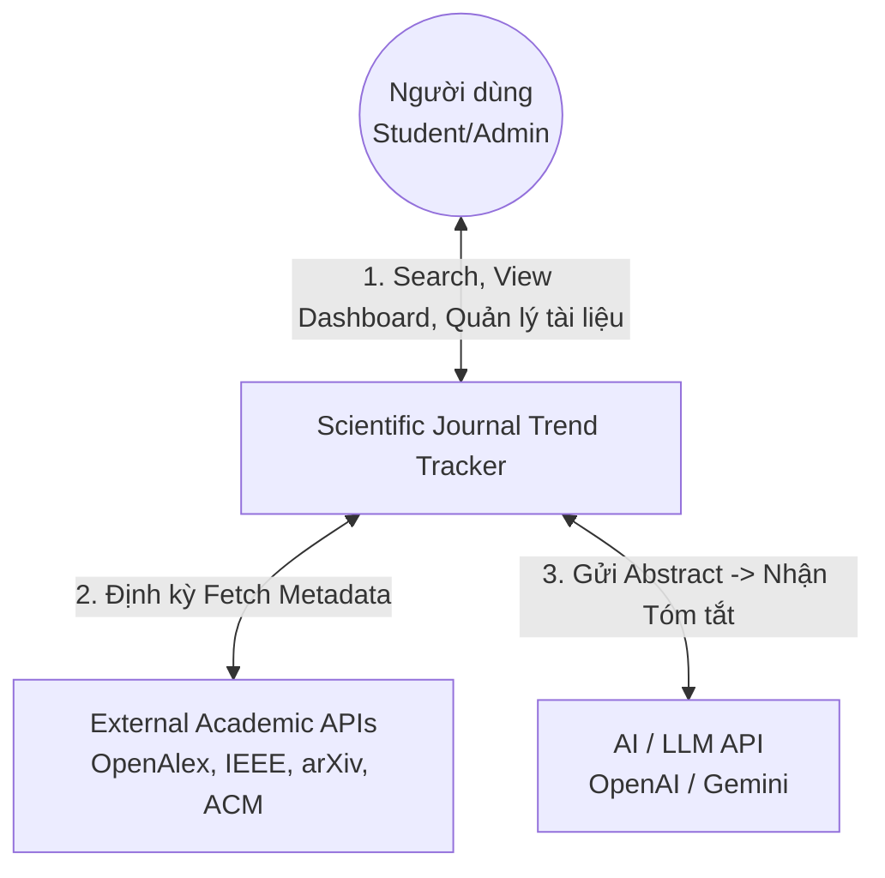
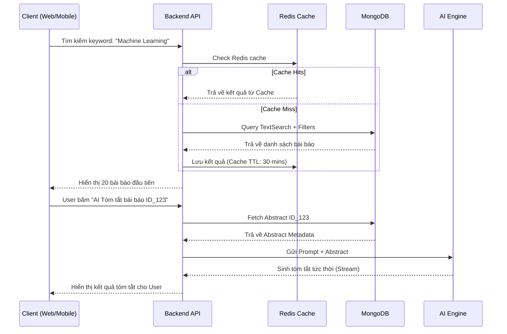

# Báo Cáo Dự Án: Hệ thống theo dõi xu hướng nghiên cứu khoa học
---
## Slide 1: Trang bìa (Title Slide)
- **Tên đề tài:** Scientific Journal Trend Tracker (Hệ thống theo dõi xu hướng bài báo khoa học)
- **Môn học/Lớp:** WDP301
- **Thành viên thực hiện:**
  - Phạm Đức Thanh Phương (SE182721)
  - Đặng Thanh Tú (SE184093)
  - Trần Đình Phong (SE184217)
  - Tô Thanh Hải (SE184086)
  - Ngô Nhật Minh (SE185018)
- **Giảng viên hướng dẫn:** [Tên giảng viên]
- **Kịch bản thuyết trình (Speaker Notes):** "Kính thưa quý thầy cô và các bạn, chắc hẳn ai trong chúng ta từng làm nghiên cứu cũng có chung một trải nghiệm: mở hàng chục tab trình duyệt — một tab tìm bài báo trên Google Scholar, openalex, researchgate một tab quản lý tài liệu trên Mendeley, một tab nhắn tin trao đổi với nhóm trên Messenger hay Zalo. Việc phải liên tục nhảy qua lại giữa các nền tảng rời rạc này không chỉ gây mất thời gian mà còn khiến quá trình nghiên cứu trở nên thiếu liền mạch. Đó chính là lý do nhóm chúng em xây dựng **Scientific Journal Trend Tracker (Hệ thống theo dõi xu hướng bài báo khoa học)** — một trợ lý nghiên cứu toàn diện, quy tụ mọi công cụ cần thiết vào một nền tảng duy nhất."

---

## Slide 2: Tổng quan dự án (Project Overview)
- **Bối cảnh (The Context):** Mỗi ngày có hàng ngàn bài báo khoa học được công bố. Sinh viên, nghiên cứu sinh bị "ngợp" trong biển thông tin và rất khó để nắm bắt xem chủ đề nào đang là xu hướng (trend).
- **Mục tiêu của hệ thống:** Xây dựng một nền tảng thu thập tự động metadata từ nhiều nguồn uy tín, làm sạch dữ liệu và trực quan hóa bằng các biểu đồ sinh động.
- **Giá trị cốt lõi:**
  - **Phát hiện "Research Gap"**: Giúp nhà nghiên cứu tìm ra những khu vực tiềm năng nhưng chưa có nhiều người khai thác.
  - **Tiết kiệm 80% thời gian**: Nhờ AI tóm tắt tự động và khả năng quản lý thư viện tập trung.

---

## Slide 3: Business Requirements 1 - Bài toán nghiệp vụ & Stakeholders
- **Bài toán nghiệp vụ cốt lõi:**
  - Làm sao để đồng bộ hóa hàng triệu bản ghi từ các API học thuật (OpenAlex, IEEE, Semantic Scholar) mà không bị trùng lặp dữ liệu?
  - Làm sao để đo lường được "sức nóng" (trend) của một từ khóa nghiên cứu theo thời gian thực?
- **Các bên liên quan (Stakeholders):**
  - **Student / Researcher (Người dùng cuối):** Cần một công cụ tìm kiếm nhanh, chính xác, có biểu đồ phân tích trực quan và tích hợp AI.
  - **System Admin (Quản trị viên):** Cần một màn hình giám sát tình trạng (health) của các tiến trình (batch jobs) đi thu thập dữ liệu hàng đêm.
  - **External Data Providers:** Các bên cung cấp API (cần tuân thủ Rate Limit và chính sách bảo mật của họ).

---

## Slide 4: Business Requirements 2 - Yêu cầu từ Stakeholders & Use Case chính
- **Yêu cầu từ Sinh viên / Nghiên cứu sinh:**
  - Hệ thống phải dễ sử dụng, giao diện hiện đại (Web & Mobile).
  - Phải có tính năng lưu trữ thư viện cá nhân (My Library) để đọc lại sau.
  - Cần AI hỗ trợ tóm tắt abstract và giải thích từ khóa khó.
- **Yêu cầu từ Quản trị viên:**
  - Hệ thống tự động hóa hoàn toàn luồng lấy dữ liệu, chỉ báo cáo khi có lỗi xảy ra.
- **Các Use Case chính (Main Use Cases):**
  1. Quản lý hệ thống Crawler định kỳ (Batch Job).
  2. Tìm kiếm và lọc nâng cao bài báo học thuật.
  3. Trực quan hóa dữ liệu Trends và Research Gaps.
  4. Phân tích văn bản bằng Trí tuệ nhân tạo (AI Summarization).

---

## Slide 5: Business Requirements 3 - Các Quy tắc Nghiệp vụ (Business Rules)
1. DANH SÁCH YÊU CẦU NGHIỆP VỤ (BUSINESS REQUIREMENTS)

Bảng dưới đây tổng hợp toàn bộ các quy tắc nghiệp vụ cốt lõi của hệ thống, bao gồm cả các luồng xử lý dữ liệu và đo lường[cite: 1].

| ID | Danh mục | Yêu cầu | Mô tả | Độ ưu tiên |
| :--- | :--- | :--- | :--- | :--- |
| **BR-001** | Thu thập & Quản lý dữ liệu | Liên kết cơ sở dữ liệu học thuật bên ngoài | Xây dựng cơ chế tự động lấy metadata (tiêu đề, abstract, từ khóa, tác giả, năm xuất bản, nguồn công bố, DOI) từ các nguồn học thuật bên ngoài như OpenAlex, Semantic Scholar, Crossref, arXiv, IEEE Xplore, ACM Digital Library và nhập vào Research Corpus. Chỉ lưu metadata, không lưu toàn văn.[cite: 1] | Cao |
| **BR-002** | Thu thập & Quản lý dữ liệu | Xử lý chuẩn hóa dữ liệu | Tích hợp định dạng dữ liệu (tên trường, format) từ các nguồn khác nhau, chuyển đổi sang schema chung có thể phân tích và lưu trữ.[cite: 1] | Cao |
| **BR-003** | Thu thập & Quản lý dữ liệu | Loại bỏ dữ liệu trùng lặp (Deduplication) | Khi cùng một bài báo được thu thập trùng lặp từ các nguồn khác nhau, sử dụng các chỉ số như DOI, tiêu đề để xác định tính đồng nhất, sau đó hợp nhất và sắp xếp bản ghi. Đảm bảo tính duy nhất của bài báo dựa trên DOI.[cite: 1] | Cao |
| **BR-004** | Thu thập & Quản lý dữ liệu | Lập lịch cập nhật dữ liệu tự động | Thực hiện tác vụ tự động thu thập thông tin bài báo học thuật mới nhất theo định kỳ, giữ Research Corpus luôn ở trạng thái mới nhất.[cite: 1] | Cao |
| **BR-005** | Thu thập & Quản lý dữ liệu | Quản lý chất lượng dữ liệu (Cleaning) | Phát hiện các giá trị thiếu hoặc thông tin không nhất quán trong dữ liệu đã thu thập, thực hiện bổ sung hoặc loại trừ.[cite: 1] | Trung bình |
| **BR-006** | Thu thập & Quản lý dữ liệu | Quản lý chính sách lưu giữ dữ liệu | Quy định thời hạn lưu giữ và điều kiện lưu trữ (archive) dữ liệu bài báo được quản lý trong hệ thống, quản lý các quy tắc vận hành. Dữ liệu trạng thái "Archived" không xuất hiện trong kết quả tìm kiếm tiêu chuẩn.[cite: 1] | Thấp |
| **BR-007** | Thu thập & Quản lý dữ liệu | Giám sát kết nối nguồn dữ liệu | Giám sát trạng thái kết nối đến các API bên ngoài và nguồn dữ liệu, thông báo cho quản trị viên khi xảy ra lỗi thu thập.[cite: 1] | Trung bình |
| **BR-008** | Thu thập & Quản lý dữ liệu | Quản lý bổ sung nguồn dữ liệu | Thiết lập cấu hình nhập dữ liệu có khả năng mở rộng để bổ sung các nguồn học thuật và cơ sở dữ liệu mới trong tương lai.[cite: 1] | Thấp |
| **BR-009** | Công cụ Tìm kiếm | Chức năng tìm kiếm từ khóa cơ bản | Dựa trên từ khóa người dùng nhập, tìm kiếm bài báo phù hợp từ tiêu đề, tóm tắt hoặc từ khóa trong Research Corpus và hiển thị danh sách kết quả.[cite: 1] | Cao |
| **BR-010** | Công cụ Tìm kiếm | Chức năng lọc theo thuộc tính | Thực hiện lọc kết quả tìm kiếm bằng cách chỉ định các thông tin thuộc tính như tên tác giả, năm xuất bản, lĩnh vực nghiên cứu, nguồn xuất bản.[cite: 1] | Cao |
| **BR-011** | Công cụ Tìm kiếm | Kết hợp điều kiện tìm kiếm nâng cao | Cho phép tìm kiếm bằng truy vấn phức tạp kết hợp nhiều điều kiện tìm kiếm (toán tử logic AND/OR/NOT, v.v.).[cite: 1] | Trung bình |
| **BR-012** | Công cụ Tìm kiếm | Sắp xếp kết quả tìm kiếm | Sắp xếp kết quả tìm kiếm dựa trên các chỉ số như mức độ liên quan, năm xuất bản (tăng dần/giảm dần), số lượt trích dẫn.[cite: 1] | Trung bình |
| **BR-013** | Công cụ Tìm kiếm | Hiển thị chi tiết metadata | Khi chọn một bài báo cụ thể từ danh sách kết quả tìm kiếm, hiển thị metadata chi tiết (tiêu đề, abstract, tác giả, từ khóa, năm, DOI) và liên kết ra bản gốc bên ngoài. Hệ thống không lưu trữ hay cung cấp toàn văn.[cite: 1] | Cao |
| **BR-014** | Công cụ Tìm kiếm | Chức năng lưu điều kiện tìm kiếm | Lưu các điều kiện tìm kiếm và cài đặt bộ lọc thường xuyên sử dụng để có thể thực thi ngay trong các lần truy cập sau. Các cài đặt này phải được load ngay khi User đăng nhập.[cite: 1] | Thấp |
| **BR-015** | Công cụ Phân tích | Phân tích xu hướng nghiên cứu theo chuỗi thời gian | Quy trình nghiệp vụ tổng hợp số lượng bài báo theo năm hoặc tháng về lĩnh vực nghiên cứu hoặc từ khóa cụ thể từ Research Corpus đã tích lũy, lượng hóa sự thay đổi xu hướng.[cite: 1] | Cao |
| **BR-016** | Công cụ Phân tích | Tính toán tốc độ tăng trưởng lĩnh vực nghiên cứu | Quy trình nghiệp vụ tính toán tỷ lệ gia tăng bài báo công bố trong một khoảng thời gian nhất định theo từng lĩnh vực nghiên cứu, xác định lĩnh vực nào đang tăng trưởng nhanh hiện tại.[cite: 1] | Cao |
| **BR-017** | Công cụ Phân tích | Đề xuất từ khóa & chủ đề liên quan | Quy trình nghiệp vụ tự động trích xuất các từ liên quan có tần suất đồng xuất hiện cao trong bài báo hoặc các chủ đề học thuật ở lĩnh vực lân cận, dựa trên chủ đề nghiên cứu hoặc từ khóa tìm kiếm đã chọn.[cite: 1] | Trung bình |
| **BR-018** | Công cụ Phân tích | Phát hiện Research Gap (Vùng trống nghiên cứu) | Quy trình nghiệp vụ so sánh số lượng bài báo công bố giữa các lĩnh vực chính, xác định các khu vực có tầm quan trọng học thuật và tiềm năng cao nhưng số lượng bài báo hiện có ít (vùng trống nghiên cứu).[cite: 1] | Cao |
| **BR-019** | Công cụ Phân tích | Lập bản đồ mối liên hệ tiềm ẩn giữa các chủ đề nghiên cứu | Quy trình nghiệp vụ phân tích mối quan hệ trích dẫn và sự chồng chéo nhóm tác giả giữa các lĩnh vực nghiên cứu khác nhau. ※Ngoài phạm vi dự án (READ.md §5.10: không hỗ trợ Citation Network, đồng trích dẫn, h-index, Impact Factor).[cite: 1] | Ngoài phạm vi |
| **BR-020** | Thu thập & Quản lý dữ liệu | Chuẩn hóa dữ liệu phục vụ phân tích | Bổ sung bước chuẩn hóa metadata sau pipeline thu thập (BR-002) để đảm bảo định dạng thống nhất, sẵn sàng cho các công cụ phân tích và thuật toán thống kê.[cite: 1] | Cao |
| **BR-021** | Công cụ Phân tích | Tự động tạo và cập nhật báo cáo phân tích | Quy trình nghiệp vụ tự động tạo và cập nhật kết quả phân tích được thực hiện định kỳ dưới dạng mà người dùng có thể xem (báo cáo tóm tắt).[cite: 1] | Trung bình |
| **BR-022** | Trực quan hóa & Dashboard | Trực quan hóa xu hướng nghiên cứu | Hiển thị biến động số lượng công bố của các chủ đề học thuật và lĩnh vực công nghệ chính theo chuỗi thời gian bằng biểu đồ đường, v.v., giúp nắm bắt trực quan tốc độ tăng trưởng và sự thay đổi mức độ quan tâm.[cite: 1] | Cao |
| **BR-023** | Trực quan hóa & Dashboard | Trực quan hóa Research Gap | Hiển thị mật độ nghiên cứu theo từng chủ đề bằng heatmap hoặc biểu đồ bong bóng, giúp nhận diện các khu vực có ít bài báo và còn dư địa nghiên cứu.[cite: 1] | Cao |
| **BR-024** | Trực quan hóa & Dashboard | Hiển thị kết quả phân tích AI | Trình bày dễ hiểu trên dashboard các kết quả phân tích do AI engine tạo ra, như tóm tắt bài báo hoặc đề xuất chủ đề nghiên cứu.[cite: 1] | Trung bình |
| **BR-025** | Trực quan hóa & Dashboard | Hiển thị báo cáo thống kê | Hiển thị số liệu thống kê dữ liệu học thuật dựa trên điều kiện tìm kiếm/phân tích dưới dạng báo cáo tóm tắt trên giao diện (không xuất file CSV/PDF trong phạm vi hiện tại).[cite: 1] | Trung bình |
| **BR-026** | Trực quan hóa & Dashboard | Dashboard tùy chỉnh | Cho phép người dùng bố trí các chủ đề quan tâm và biểu đồ thống kê lên dashboard cá nhân, điều chỉnh các mục hiển thị phù hợp với nhu cầu nghiên cứu của mình.[cite: 1] | Thấp |
| **BR-027** | Quản lý Thư viện | Chức năng lưu tài liệu | Người dùng có thể chọn bài báo cụ thể từ kết quả tìm kiếm và lưu vào Thư viện cá nhân (My Library) dưới dạng tham chiếu (Reference).[cite: 1] | Cao |
| **BR-028** | Quản lý Thư viện | Quản lý Bộ sưu tập (Thư mục) | Cho phép tạo, chỉnh sửa, xóa thư mục hoặc bộ sưu tập để phân loại tài liệu. Đảm bảo tính toàn vẹn thư viện nếu bài báo gốc bị xóa.[cite: 1] | Trung bình |
| **BR-029** | Quản lý Thư viện | Cài đặt theo dõi chủ đề quan tâm | Người dùng thiết lập lĩnh vực nghiên cứu hoặc từ khóa cụ thể làm đối tượng theo dõi, có thể xem danh sách bất cứ lúc nào.[cite: 1] | Cao |
| **BR-030** | Quản lý Thư viện | Chức năng thông báo cập nhật | Chức năng gửi thông báo cho người dùng khi có bài báo mới liên quan đến chủ đề theo dõi. Thông báo sẽ tự động bị xóa sau 30 ngày.[cite: 1] | Trung bình |
| **BR-031** | Quản lý Thư viện | Tìm kiếm tài liệu trong thư viện | Người dùng có thể lọc và tìm kiếm tài liệu đã lưu bằng từ khóa hoặc ngày lưu.[cite: 1] | Trung bình |
| **BR-032** | Quản lý Thư viện | Chia sẻ & Xuất thông tin tài liệu | Cho phép chia sẻ danh sách tài liệu đã lưu hoặc xuất thông tin ở định dạng có thể sử dụng bởi phần mềm quản lý thư mục. ※Ngoài phạm vi dự án (READ.md §5.7: không hỗ trợ chia sẻ bộ sưu tập; §5.9: không tích hợp Mendeley, Zotero, EndNote).[cite: 1] | Ngoài phạm vi |
| **BR-033** | Chức năng Hỗ trợ AI | Cung cấp tóm tắt bài báo tự động | AI trích xuất và trình bày ngắn gọn các luận điểm chính dựa trên abstract/metadata đã thu thập (không phân tích toàn văn). Sinh ra tức thời, không lưu vĩnh viễn vào DB.[cite: 1] | Cao |
| **BR-034** | Chức năng Hỗ trợ AI | Gợi ý tài liệu liên quan động | Tự động đề xuất các bài báo có liên quan cao dựa trên bài báo đang xem hoặc lịch sử tìm kiếm.[cite: 1] | Cao |
| **BR-035** | Chức năng Hỗ trợ AI | Giải thích thuật ngữ chuyên môn | Khi chọn thuật ngữ chuyên môn, AI hiển thị định nghĩa ngắn gọn. Sinh ra tức thời, không lưu vĩnh viễn vào DB.[cite: 1] | Trung bình |
| **BR-036** | Chức năng Hỗ trợ AI | Đề xuất chủ đề & hướng nghiên cứu | Dựa trên lĩnh vực quan tâm, phân tích Research Gap và abstract/metadata, AI đề xuất các chủ đề nghiên cứu có tính mới cao (không soạn thảo bài báo/luận văn thay người dùng).[cite: 1] | Cao |
| **BR-037** | Chức năng Hỗ trợ AI | Hiển thị căn cứ phân tích AI | Khi AI thực hiện tóm tắt/đề xuất, trình bày liên kết đến dữ liệu làm căn cứ để đảm bảo tính hợp lệ.[cite: 1] | Trung bình |
| **BR-038** | Quản lý Hệ thống | Quản lý tài khoản người dùng | Quy trình quản lý đăng ký, xác thực và thông tin hồ sơ cho mọi đối tượng sử dụng hệ thống.[cite: 1] | Cao |
| **BR-039** | Quản lý Hệ thống | Kiểm soát truy cập (RBAC) | Định nghĩa quyền hạn theo Role. Quản trị viên quản lý hệ thống, người dùng sử dụng thư viện/phân tích. Role load tức thì cùng Profile.[cite: 1] | Cao |
| **BR-040** | Quản lý Hệ thống | Vận hành & bảo trì hệ thống | Quy trình thay đổi cài đặt hệ thống, duy trì tính toàn vẹn cơ sở dữ liệu.[cite: 1] | Trung bình |
| **BR-041** | Quản lý Hệ thống | Giám sát nhật ký hệ thống | Quy trình ghi lại lịch sử thực thi tìm kiếm, tần suất truy cập (lượt xem, tìm kiếm) và lỗi hệ thống.[cite: 1] | Trung bình |
| **BR-042** | Quản lý Hệ thống | Thu thập phản hồi người dùng | Cơ chế gửi yêu cầu cải thiện hoặc phản hồi về chức năng, Admin tổng hợp và xử lý.[cite: 1] | Thấp |
| **BR-043** | Công cụ Phân tích | Đo lường Unique Views | Khi người dùng xem bài báo, hệ thống ghi nhận 1 lượt view. Mở lại trong vòng 30 phút KHÔNG ghi nhận thêm. Hết 30 phút tính là phiên mới.[cite: 1] | Cao |
| **BR-044** | Dashboard | Thống kê Top Bài báo thịnh hành | Truy xuất và hiển thị danh sách bài báo đọc nhiều nhất (VD: 30 ngày qua) dựa trên Unique Views phục vụ phân tích/AI.[cite: 1] | Cao |

---
## slide 
Danh sách yêu cầu chức năng


| id | Tên chức năng | Mô tả | Yêu cầu liên quan | Độ ưu tiên |
| --- | --- | --- | --- | --- |
| FR-001 | Xử lý batch thu thập dữ liệu bên ngoài | Chức năng tự động thực thi để định kỳ lấy metadata bài báo từ các API học thuật (OpenAlex, Semantic Scholar, Crossref, arXiv, IEEE Xplore, ACM Digital Library) và đưa vào Research Corpus. Chỉ thu thập metadata, không lưu toàn văn. ※Cần xác nhận: Tần suất thực thi | BR-001, BR-004 | Cao |
| FR-002 | Chuẩn hóa dữ liệu bài báo & loại bỏ trùng lặp | Xử lý backend chuyển đổi dữ liệu thu thập sang schema chung (tiêu đề, abstract, từ khóa, tác giả, năm, nguồn, DOI), làm sạch dữ liệu thiếu/không nhất quán, và hợp nhất bản trùng dựa trên DOI (và tiêu đề khi thiếu DOI). | BR-002, BR-003, BR-005, BR-020 | Cao |
| FR-003 | Công cụ tìm kiếm bài báo | Cung cấp tìm kiếm theo từ khóa, tiêu đề, tác giả, lĩnh vực, năm xuất bản; lọc theo thuộc tính; truy vấn nâng cao (AND/OR/NOT); sắp xếp kết quả theo mức độ liên quan, năm, số trích dẫn. | BR-009, BR-010, BR-011, BR-012 | Cao |
| FR-004 | Màn hình hiển thị chi tiết bài báo | Hiển thị metadata bài báo, abstract từ nguồn gốc và liên kết ra bản gốc bên ngoài (publisher/arXiv). Ghi nhận lượt xem (Unique Views) khi người dùng mở chi tiết. | BR-013, BR-043 | Cao |
| FR-005 | Công cụ phân tích xu hướng | Xử lý backend thống kê số lượng bài báo theo thời gian, tính tốc độ tăng trưởng và gợi ý từ khóa/chủ đề liên quan dựa trên cấu trúc liên kết trong Research Corpus. | BR-015, BR-016, BR-017 | Cao |
| FR-006 | Xử lý phát hiện Research Gap | Phân tích so sánh mật độ công bố giữa các chủ đề để xác định lĩnh vực có tiềm năng nhưng ít bài báo (Research Gap). | BR-018 | Cao |
| FR-007 | Dashboard trực quan hóa | Frontend hiển thị biểu đồ xu hướng theo thời gian, heatmap Research Gap, Top bài báo thịnh hành và kết quả phân tích AI trên dashboard tổng quan. | BR-022, BR-023, BR-024, BR-044 | Cao |
| FR-008 | Chức năng quản lý Thư viện cá nhân | CRUD lưu bài báo dưới dạng tham chiếu, tạo/sửa/xóa thư mục phân loại, tìm kiếm trong thư viện. Đảm bảo toàn vẹn thư viện khi bài gốc bị xóa hoặc archive. | BR-027, BR-028, BR-031 | Cao |
| FR-009 | Chức năng hỗ trợ & tóm tắt bài báo bằng AI | AI tóm tắt dựa trên abstract/metadata, gợi ý tài liệu liên quan, giải thích thuật ngữ, đề xuất hướng nghiên cứu từ Research Gap và hiển thị căn cứ phân tích. Không phân tích toàn văn. ※Cần xác nhận: LLM API sử dụng | BR-033, BR-034, BR-035, BR-036, BR-037 | Cao |
| FR-010 | Theo dõi chủ đề & thông báo | Người dùng thiết lập từ khóa/lĩnh vực theo dõi, xem danh sách bất cứ lúc nào; hệ thống thông báo khi có bài mới liên quan (thông báo tự xóa sau 30 ngày). ※Cần xác nhận: Kênh thông báo | BR-029, BR-030 | Cao |
| FR-011 | Chức năng quản lý người dùng | Đăng ký, đăng nhập, quản lý hồ sơ và kiểm soát quyền truy cập theo RBAC. | BR-038, BR-039 | Cao |
| FR-012 | Dashboard quản trị | Màn hình Admin giám sát lỗi thu thập/kết nối API, xem log hệ thống, cấu hình và mở rộng nguồn dữ liệu, vận hành Research Corpus. | BR-007, BR-008, BR-040, BR-041 | Trung bình |
| FR-013 | Hiển thị báo cáo phân tích | Hiển thị số liệu thống kê theo điều kiện tìm kiếm/phân tích dưới dạng báo cáo tóm tắt trên giao diện; tự động tạo/cập nhật báo cáo định kỳ. | BR-021, BR-025 | Trung bình |

## Slide : Business Requirements 4 - Yêu cầu phi chức năng (Non-Functional Requirements)
# Danh sách yêu cầu phi chức năng

| id | Danh mục | Yêu cầu | Giá trị mục tiêu | Độ ưu tiên | Liên quan |
| --- | --- | --- | --- | --- | --- |
| NFR-001 | Hiệu năng | Thời gian phản hồi tìm kiếm & phân tích | Hiển thị kết quả tìm kiếm và vẽ biểu đồ phân tích trong **≤ 3 giây** (P95). ※Cần xác nhận: ngưỡng theo quy mô Research Corpus | Cao | FR-003, FR-005, FR-007; Redis cache |
| NFR-002 | Khả dụng | Tỷ lệ uptime hệ thống | **99.9%** (không tính thời gian bảo trì đã thông báo) | Trung bình | READ.md §7 |
| NFR-003 | Bảo mật | Xác thực & phân quyền | Đăng ký/đăng nhập bằng **email + mật khẩu** (hash bcrypt), kiểm soát truy cập **RBAC** (Student \| Admin). Phiên đăng nhập an toàn (JWT hoặc session server-side). ※Cần xác nhận: OAuth2/OIDC/SSO — **chưa nằm trong phạm vi hiện tại** (READ.md §5.9: không tích hợp LMS/SIS) | Cao | FR-011, BR-038, BR-039; `users` |
| NFR-004 | Vận hành | Giám sát batch thu thập dữ liệu | Khi thu thập từ API bên ngoài **thất bại**, gửi cảnh báo cho Admin qua dashboard/log. Ghi nhận trạng thái sync trên `data_sources`. ※Cần xác nhận: thời gian trễ thu thập cho phép | Trung bình | FR-001, FR-012, BR-007; `data_sources`, `system_logs` |
| NFR-005 | Khả năng mở rộng dữ liệu | Thêm/sửa nguồn dữ liệu | Bổ sung nguồn học thuật mới chủ yếu qua **cấu hình** (`data_sources`), không cần sửa core schema `papers`. ※Cần xác nhận: lộ trình nguồn mới ngoài 6 nguồn READ.md §6 | Trung bình | FR-012, BR-008; READ.md §6 |
| NFR-006 | Khả mở rộng | Scalability | Thiết kế **scale ngang** cho tải đồng thời khi số người dùng tăng (hàng nghìn → hàng chục nghìn). MongoDB + Redis, tách read-heavy (search/dashboard) khỏi batch write. ※Cần xác nhận: số user mục tiêu cụ thể | Cao | MongoDB, Redis; READ.md §3 |
| NFR-007 | Hiệu năng | Thời gian hoàn thành batch | Batch đêm cập nhật **incremental** toàn bộ 6 nguồn dữ liệu trong **≤ 8 giờ**. ※Cần xác nhận: tần suất sync từng nguồn | Trung bình | FR-001, BR-004; `data_sources` |
| NFR-008 | Bảo mật | Mã hóa truyền tải | Toàn bộ giao tiếp client–server và server–API bên ngoài dùng **TLS 1.2 trở lên** (khuyến nghị TLS 1.3). | Cao | — |
| NFR-009 | Vận hành | Sao lưu & phục hồi | MongoDB sao lưu **hàng ngày**. Mục tiêu **RPO ≤ 24 giờ**, **RTO ≤ 4 giờ**. ※Cần xác nhận: mức mất dữ liệu chấp nhận được | Trung bình | MongoDB |
| NFR-010 | Bảo mật | Bảo vệ dữ liệu khi dùng AI | Chỉ gửi **abstract/metadata công khai** tới LLM; **không** gửi email, mật khẩu, nội dung thư viện riêng tư. Mask/loại trừ PII trước khi gọi API. ※Cần xác nhận: chính sách huấn luyện/lưu log của LLM | Cao | FR-009, BR-033~037; READ.md §5.8 |
| NFR-011 | Hiệu năng | Cache tầng Redis | Top bài thịnh hành, dedup Unique Views (30 phút), báo cáo phân tích hot: phản hồi từ cache **≤ 500 ms** (P95). | Trung bình | BR-043, BR-044; bsonSchema.md §3 |
| NFR-012 | Ràng buộc kiến trúc | Không Public API | Giai đoạn hiện tại **không** expose REST/GraphQL công khai cho bên thứ ba (READ.md §5.9). | Cao | READ.md §5.9 |

---

---

## Slide 7: System Diagrams - Ngữ cảnh hệ thống (Context Diagram)
*(Chèn hình vẽ từ mã Mermaid dưới đây)*


- **Giải thích:** Hệ thống đóng vai trò trung tâm (Hub) kết nối người dùng, các thư viện dữ liệu toàn cầu và các động cơ Trí tuệ nhân tạo.

---

## Slide 8: System Diagrams - Sơ đồ Use Case (Use Case Diagram)
*(Chèn hình vẽ từ mã Mermaid dưới đây)*

```mermaid
usecase diagram
    Actor Student
    Actor Admin

    Student --> (Tìm kiếm bài báo nâng cao)
    Student --> (Xem Dashboard Phân tích Trend)
    Student --> (Quản lý Thư viện - My Library)
    Student --> (Yêu cầu AI tóm tắt bài báo)
    
    Admin --> (Quản trị Tài khoản)
    Admin --> (Giám sát Batch Job Thu Thập)
    Admin --> (Cấu hình Nguồn Data)
```
- **Giải thích:** Hai nhóm Actor chính là Student (Sử dụng dữ liệu) và Admin (Vận hành, nạp dữ liệu).

---

## Slide 9: System Diagrams - Biểu đồ Tuần tự (Sequence Diagram - Luồng tìm kiếm & AI)
*(Chèn hình vẽ từ mã Mermaid dưới đây)*



---

## Slide 10: System Diagrams - Sơ đồ cơ sở dữ liệu (ERD Summary)
*(Phân tích chiến lược thiết kế NoSQL)*

- Hệ thống sử dụng **MongoDB** làm cơ sở dữ liệu chính với 2 chiến lược thiết kế (Pattern):
  - **Embedded Pattern (Nhúng):** Dùng cho Collection `papers`. Mảng `authors`, `keywords`, và `sources` được nhúng trực tiếp vào trong bài báo. Rất tối ưu cho tác vụ Đọc (Read-heavy) vì lấy 1 lần là đủ dữ liệu.
  - **Reference Pattern (Tham chiếu):** Dùng cho `user_collections` và `paper_views`. Vì số lượng view hay số bài báo user lưu sẽ tăng vô hạn (Unbounded Growth), việc tách ra Collection riêng rẽ giúp Document chính không bị chạm mức giới hạn 16MB của MongoDB.

---

## Slide 11: Kiến trúc tổng thể (System Architecture)
- **Mô hình kiến trúc:** Client - Server API (Decoupled). Mọi giao tiếp diễn ra qua RESTful JSON API.
- **Tầng Client (Presentation):**
  - Web Admin / Web Dashboard: Dùng ReactJS, Vite. Thích hợp thao tác phức tạp.
  - Mobile App: Dùng React Native (Expo SDK 54). Hỗ trợ Push Notification.
- **Tầng API / Logic:** Node.js, Express.js xử lý Authentication (JWT) và Business Logic.
- **Tầng Dữ liệu:**
  - **MongoDB:** Lưu trữ dữ liệu lâu dài (Persistent Data).
  - **Redis:** Lưu Cache tạm thời (In-memory) giúp giảm tải DB lên đến 60%.

---

## Slide 12: Backend Architecture & Luồng dữ liệu (Data Pipeline)
- **Công nghệ cốt lõi:** Node.js, Express 5.x, Mongoose 9.x.
- **Kiến trúc Layered:** Request đi qua Router ➔ Controller (validate dữ liệu) ➔ Service (xử lý logic) ➔ Model (gọi Database).
- **Source Mappers (Xử lý Data thô):**
  - Backend sử dụng mẫu thiết kế Adapter. API trả về từ IEEE và OpenAlex khác hẳn nhau về format.
  - Backend sẽ "chuẩn hóa" (map) tất cả về 1 JSON chuẩn chứa: `title`, `doi`, `abstract`, `publication_year`.
- **Bảo mật (Security):** Tích hợp `helmet` chống XSS, `express-rate-limit` chống DDOS, và băm mật khẩu `bcrypt`.

---

## Slide 13: Frontend Web - Trải nghiệm & Trực quan hóa
- **Công nghệ:** React 19, TypeScript (Đảm bảo an toàn kiểu dữ liệu).
- **Dashboard Phân tích (Analytics UI):**
  - **Biểu đồ 2D (Recharts):** Render đồ thị dạng Đường (Line) và Cột (Bar) cho báo cáo tốc độ tăng trưởng.
  - **Biểu đồ 3D / Nâng cao (React Three Fiber):** Ứng dụng WebGL / Three.js để vẽ biểu đồ mật độ dạng phân tán (Scatter Plot) giúp người dùng "nhìn thấy" các khoảng trống nghiên cứu (Research Gaps) một cách trực quan trong không gian nhiều chiều.
- **Trải nghiệm UX:** Giao diện tách biệt thành các Card Component, trạng thái tìm kiếm giữ nguyên không độ trễ.

---

## Slide 14: Mobile App (React Native/Expo) - Trải nghiệm người dùng di động
- **Kiến trúc ứng dụng:** Xây dựng bằng React Native qua Expo SDK 54, chạy trên cả iOS & Android chung một mã nguồn.
- **Hệ thống Routing:** Dùng **Expo Router** (File-based routing) để tổ chức Navigation mượt mà hơn.
- **Các Module chính trên App:**
  - `(tabs)/trends`: Màn hình biểu đồ thu gọn, dùng `react-native-chart-kit`.
  - `(tabs)/library`: Thư viện cá nhân mang theo mọi nơi. Đọc tóm tắt AI trên xe bus.
- **Cải tiến UX:**
  - `expo-haptics`: Điện thoại rung nhẹ phản hồi mỗi khi lưu thành công bài báo.
  - Tích hợp Sockets để cập nhật kết quả theo thời gian thực.

---

## Slide 15: Tích hợp Hệ thống & Xử lý Dữ liệu (Deduplication)
- **Thách thức:** Bài báo *"Deep Learning in Medicine"* xuất hiện ở cả IEEE và Semantic Scholar, dẫn đến hiển thị lặp 2 lần cho người dùng.
- **Giải pháp (Deduplication Pipeline):**
  1. Khi Cron Job ban đêm kéo dữ liệu mới về, thuật toán quét chỉ mục `DOI` (Digital Object Identifier).
  2. Nếu tìm thấy bài đã có cùng `DOI`, hệ thống chỉ gộp mảng `sources` lại thay vì tạo mới.
  3. Nếu bài không có `DOI`, so khớp thông minh bằng `Title_Normalized` (Bỏ ký tự đặc biệt, chuyển in thường).
- Cơ chế này đảm bảo dữ liệu Research Corpus luôn "sạch sẽ" và chính xác.

---

## Slide 16: Trí tuệ Nhân tạo (AI Integration) - Hỗ trợ nghiên cứu
- **Nguyên lý hoạt động "Stateless AI":** 
  - Thay vì thuê Server đắt tiền chạy mô hình AI nặng nề, hệ thống kết nối trực tiếp với LLM (OpenAI / Gemini) qua API.
  - Hệ thống **Không lưu** kết quả tóm tắt vào DB để tiết kiệm ổ cứng. Khi sinh viên bấm "Tóm tắt", hệ thống mới gọi API sinh văn bản tức thời (On-The-Fly).
- **Tính năng AI cung cấp:**
  - Tóm tắt Abstract thành 3 gạch đầu dòng (Key Takeaways).
  - Đề xuất tài liệu liên quan dựa trên ngữ nghĩa của tiêu đề bài đang đọc.
  - Giải thích các thuật ngữ chuyên môn ngay trong trang chi tiết.

---

## Slide 17: Demo Hệ thống / Kết quả thực tiễn
*(Trình chiếu Video thực tế, hoặc Demo trực tiếp phần mềm)*

- **Flow 1 (Tìm kiếm & Dashboard):** Admin tìm từ khóa "Quantum Computing", lọc theo năm 2024. Bảng Dashboard lập tức vẽ lại biểu đồ tăng trưởng nhờ Data trả về từ Redis cực nhanh.
- **Flow 2 (Research Gap):** Sinh viên nhìn vào Heatmap và nhận ra "Quantum Error Correction" là mảng ít người viết nhưng lượt tìm kiếm cao ➔ Quyết định chọn làm đề tài tốt nghiệp.
- **Flow 3 (Mobile Experience):** Bấm "Lưu vào Thư viện", điện thoại (App Expo) lập tức rung haptics và đồng bộ bài viết xuống Local.

---

## Slide 18: Các Khó khăn Kỹ thuật & Giải pháp (Technical Challenges)
1. **Bài toán Spam View (Thống kê ảo):**
   - **Lỗi:** Mỗi lần F5 trang web lại tính là 1 lượt xem (View), làm sai lệch thuật toán Trending. Truy vấn đếm view ở DB quá chậm.
   - **Giải pháp:** Xây dựng **Redis Gate**. Khi click bài báo, lưu Key `view:{paperID}:{userID}` vào Redis, cho hết hạn (TTL) sau 30 phút. Trong 30 phút đó, các click tiếp theo bị Redis từ chối ghi nhận vào MongoDB.
2. **Khó khăn khi tính toán Research Gap trên tập dữ liệu quá lớn:**
   - **Lỗi:** Request API Dashboard bị quá tải (Timeout) do phải Aggregate hàng triệu Document.
   - **Giải pháp:** Tách biệt luồng Read/Write. Dùng Batch Job chạy lúc 2h sáng tính toán sẵn tất cả báo cáo và lưu vào `analysis_reports` (Snapshot). Sáng ra User mở Web chỉ mất 0.5s để load kết quả Snapshot.

---

## Slide 19: Kết quả đạt được & Đánh giá (Evaluation)
- **Về mục tiêu dự án:** Hoàn thành xuất sắc MVP (Minimum Viable Product). Xây dựng trọn vẹn từ Backend đến Frontend Web và Mobile App. Đã tự động thu thập được hàng ngàn bài báo.
- **Về trải nghiệm UX:** Đồng nhất được các nghiệp vụ (Tìm kiếm, Lưu trữ, Tóm tắt AI) vào một nền tảng duy nhất, giải quyết trúng Pain-point ở Slide 1.
- **Về thông số kỹ thuật:**
  - Thời gian API Response trung bình < 3 giây (Đạt yêu cầu NFR).
  - Database được thiết kế đúng chuẩn NoSQL Scale ngang. Thuật toán lọc trùng lặp hoạt động ổn định.

---

## Slide 20: Hướng phát triển tiếp theo (Future Works)
Nếu có thêm thời gian, nhóm dự định phát triển các tính năng cao cấp cho giới hàn lâm:
- **Xây dựng Mạng lưới trích dẫn (Citation Network):** Khai thác quan hệ các bài báo để vẽ ra bản đồ "Bài này trích dẫn bài nào", tự động tính toán chỉ số h-index của tác giả.
- **Hỗ trợ Export theo chuẩn Quốc tế:** Cho phép xuất file .bib, .ris để user nhập vào EndNote, Mendeley.
- **LLM Local (Chủ quyền AI):** Cài đặt và Fine-tune một mô hình AI nhẹ (như Llama 3) chạy trực tiếp trên Server nhà trường, thay vì phụ thuộc và tốn tiền gọi API OpenAI bên ngoài.

---

## Slide 21: Q&A / Cảm ơn
- Thay mặt nhóm, em xin gửi lời cảm ơn chân thành đến giảng viên hướng dẫn đã đồng hành cùng chúng em trong suốt đồ án này.
- Xin kính mời quý thầy cô và các bạn đặt câu hỏi.
- **(Để lại QR Code tải app di động và URL web để hội đồng trải nghiệm trực tiếp).**
