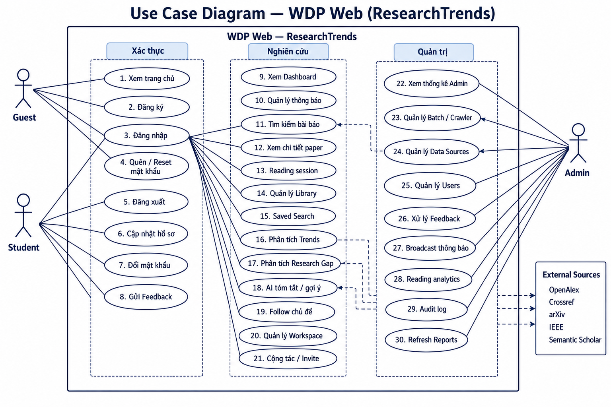
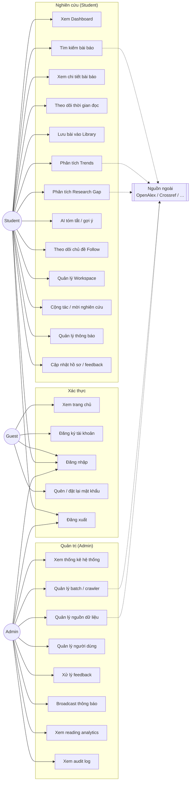
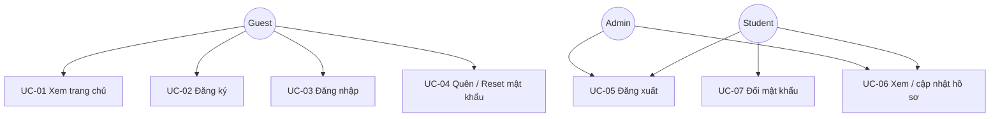
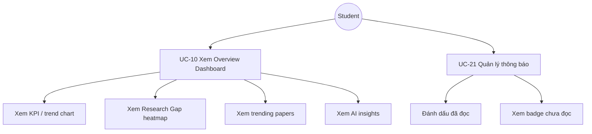
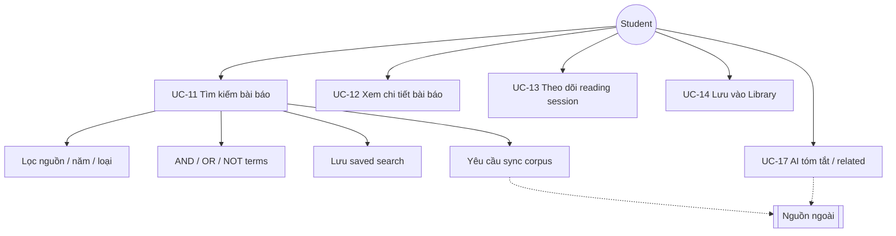
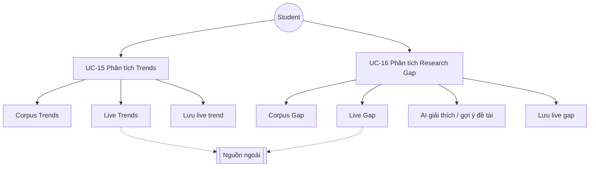
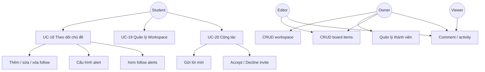
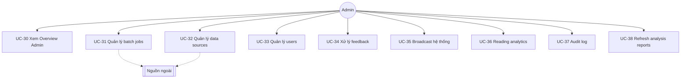

# Use Case Diagram — WDP Web (ResearchTrends)

> Tài liệu mô tả các **use case** của hệ thống web WDP: Scientific Research Trend Tracking System.  
> Cập nhật theo code thực tế tại `web/frontend` + `web/backend` (tháng 07/2026).

---

## 1. Actors

| Actor | Vai trò hệ thống | Mô tả |
|---|---|---|
| **Guest** | Khách | Chưa đăng nhập. Chỉ xem landing + auth. |
| **Student** | `User.roles = Student` | Người dùng nghiên cứu mặc định sau đăng ký. Dùng toàn bộ app shell. |
| **Admin** | `User.roles = Admin` | Quản trị viên. Bị khóa vào `#admin`, không vào Student shell. |
| **Workspace Owner / Editor / Viewer** | Role trong workspace | Vai trò phụ của Student trong không gian cộng tác. |
| **Hệ thống nguồn ngoài** | Secondary actor | OpenAlex, Crossref, arXiv, IEEE, Semantic Scholar, Exa, … |

**Ghi chú phân quyền UI:**

- Guest → `#home`, `#login`, `#register`, `#forgot-password`, `#reset-password`
- Student → toàn bộ sidebar (`#overview` … `#account`)
- Admin → chỉ `#admin` (redirect mọi route khác về admin)

---

## 2. Use Case Diagram Tổng Quan



> File ảnh: `web/HaiTT/docs/images/usecase-web-diagram.png` (bản đủ 30 UC, nhóm Xác thực / Nghiên cứu / Quản trị)



---

## 3. Use Case theo nhóm chức năng

### 3.1 Xác thực & tài khoản



| ID | Use case | Actor | Route / API | Auth |
|---|---|---|---|---|
| UC-01 | Xem trang chủ marketing | Guest | `#home` | Public |
| UC-02 | Đăng ký tài khoản (→ Student) | Guest | `#register` / `POST /auth/register` | Public |
| UC-03 | Đăng nhập | Guest | `#login` / `POST /auth/login` | Public |
| UC-04 | Quên / đặt lại mật khẩu | Guest | `#forgot-password`, `#reset-password` | Public |
| UC-05 | Đăng xuất | Student, Admin | Clear token | Auth |
| UC-06 | Xem / cập nhật hồ sơ | Student, Admin | `#account` / `users` | Auth |
| UC-07 | Đổi mật khẩu | Student, Admin | `#account` | Auth |

---

### 3.2 Dashboard & thông báo



| ID | Use case | Route | Ghi chú |
|---|---|---|---|
| UC-10 | Xem Dashboard tổng quan | `#overview` | KPI, chart, heatmap, trending, AI |
| UC-21 | Quản lý hộp thư thông báo | `#notifications` | Mark read / unread badge |

---

### 3.3 Tìm kiếm & bài báo



| ID | Use case | Route / API | Include |
|---|---|---|---|
| UC-11 | Tìm kiếm đa nguồn + facet | `#search` / `GET /papers` | Filter, Boolean, saved search, sync |
| UC-12 | Xem chi tiết paper | `#paper/:id` | Metadata, abstract, sources |
| UC-13 | Bắt đầu / cập nhật reading session | `papers/.../reading` | Dwell time ≥ 2 phút → stored |
| UC-14 | Lưu / quản lý Library | `#library` | Collection, notes, read status |
| UC-17 | AI summarize + related papers | AI APIs | Chỉ diễn giải từ evidence |

---

### 3.4 Trends & Research Gap



| ID | Use case | Route | Nguồn dữ liệu |
|---|---|---|---|
| UC-15a | Corpus Trends | `#trends` | MongoDB + AnalysisReport |
| UC-15b | Live Trends | `#trends` | API ngoài theo topic |
| UC-16a | Corpus Gap | `#gap` | Heatmap / scatter / ranking nội bộ |
| UC-16b | Live Gap | `#gap` | Fetch + score in-memory |
| UC-16c | AI explain term / suggest directions | AI APIs | Không tự bịa gap |

---

### 3.5 Follow & Workspace



| Role workspace | Quyền chính |
|---|---|
| **Owner** | Full: CRUD workspace, đổi role member, xóa workspace |
| **Editor** | Tạo/sửa items, comment |
| **Viewer** | Xem + comment (read-oriented) |

---

### 3.6 Admin Console



| ID | Use case | Admin tab | API group |
|---|---|---|---|
| UC-30 | Xem thống kê hệ thống | Overview | `/admin` |
| UC-31 | List / tạo / chạy crawler batch | Batch jobs | `/admin/jobs` |
| UC-32 | Bật/tắt nguồn, credentials, health check | Data sources | `/admin/sources` |
| UC-33 | CRUD user, role, status | Users | `/admin/users` |
| UC-34 | Duyệt / trả lời feedback | Feedback | `/feedbacks` |
| UC-35 | Broadcast signal toàn hệ thống | Broadcast | `/admin` |
| UC-36 | Thống kê thời gian đọc | Reading stats | `/admin/analytics` |
| UC-37 | Xem audit / system log | Audit log | `/admin/logs` |
| UC-38 | Refresh báo cáo phân tích | Reports | `/admin/reports` |

---

## 4. Ma trận Actor × Use Case

| Use case | Guest | Student | Admin | Nguồn ngoài |
|---|:---:|:---:|:---:|:---:|
| Xem trang chủ | ● | ○ | ○ | |
| Đăng ký / Đăng nhập / Reset MK | ● | | | |
| Đăng xuất / Hồ sơ | | ● | ● | |
| Dashboard Overview | | ● | | |
| Thông báo | | ● | | |
| Tìm kiếm / Chi tiết paper | | ● | | ◐ |
| Reading session | | ● | | |
| Library | | ● | | |
| Trends (Corpus / Live) | | ● | | ◐ |
| Research Gap (Corpus / Live) | | ● | | ◐ |
| AI tóm tắt / gợi ý | | ● | | ◐ |
| Follow subjects | | ● | | |
| Workspace & Collaboration | | ● | | |
| Feedback | | ● | ● | |
| Admin console (toàn bộ) | | | ● | ◐ |

**Chú thích:** `●` primary · `○` có thể sau login nhưng UI redirect · `◐` phụ thuộc / gọi gián tiếp qua backend

---

## 5. Quan hệ Include / Extend (tóm tắt)

```text
UC-11 Tìm kiếm bài báo
  ├── «include» Lọc facet (nguồn, năm, type)
  ├── «include» Boolean AND/OR/NOT
  ├── «extend»  Lưu saved search          [khi user bấm Save]
  └── «extend»  Request corpus sync       [khi kết quả thiếu / user yêu cầu]

UC-12 Xem chi tiết bài báo
  ├── «include» Ghi nhận view (dedup Redis)
  ├── «extend»  Reading session           [khi mở detail đủ lâu]
  ├── «extend»  AI summarize              [khi user bấm AI]
  └── «extend»  Lưu Library               [khi user Save]

UC-16 Phân tích Research Gap
  ├── «include» Tính score từ evidence
  ├── «extend»  Live fetch nguồn ngoài    [tab Live Gap]
  └── «extend»  AI diễn giải / gợi ý đề tài

UC-19 Quản lý Workspace
  ├── «include» Phân quyền Owner/Editor/Viewer
  └── «extend»  Realtime comment (socket) [khi có thành viên online]
```

---

## 6. Map Route Frontend ↔ Use Case

| Hash route | Page | Use case chính |
|---|---|---|
| `#home` | HomePage | UC-01 |
| `#login` / `#register` / `#forgot-password` / `#reset-password` | Auth pages | UC-02 → UC-04 |
| `#overview` | OverviewPage | UC-10 |
| `#notifications` | NotificationPage | UC-21 |
| `#search` | SearchPage | UC-11 |
| `#paper/:id` | PaperDetailPage | UC-12, UC-13, UC-17 |
| `#trends` | TrendsPage | UC-15 |
| `#gap` | GapPage | UC-16 |
| `#library` | LibraryPage | UC-14 |
| `#follow` | FollowPage | UC-18 |
| `#workspace` | WorkspacePage | UC-19, UC-20 |
| `#account` | AccountPage | UC-06, UC-07, feedback |
| `#admin` | AdminPage | UC-30 → UC-38 |

---

## 7. Ghi chú thiết kế

1. **Admin không dùng Student shell** — `App.tsx` redirect Admin về `#admin`.
2. **Guest không vào app** — mọi route ngoài auth/home yêu cầu login.
3. **Live Trends / Live Gap** không bắt buộc import full paper vào MongoDB; backend gọi API ngoài, chuẩn hóa, score in-memory.
4. **AI không tự bịa gap/trend** — chỉ diễn giải / gợi ý trên evidence đã tính.
5. Tài liệu chi tiết từng feature: xem `research-gap-guide.md`, `trend-analysis-guide.md`.
